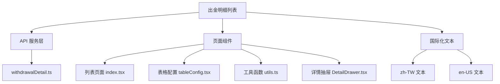
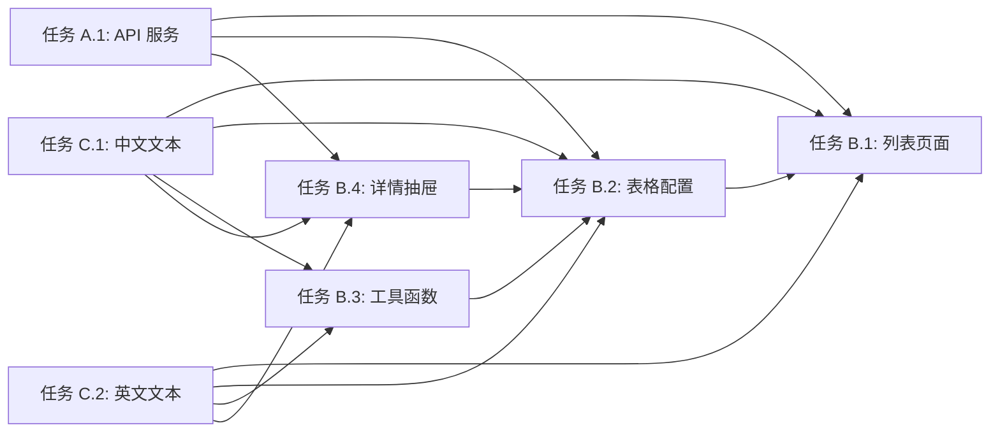

# 功能规划：出金明细列表页面

**规划时间**：2026-04-03
**预估工作量**：10 任务点

---

## 1. 功能概述

### 1.1 目标

创建出金明细列表页面，展示用户的出金交易记录，支持多维度筛选和详情查看。

### 1.2 范围

**包含**：

- 出金明细列表展示（表格）
- 多维度筛选（订单 ID、通道、用户 ID、接收地址、接收链、接收币种、状态）
- 详情抽屉（展示完整出金信息和链上交易）
- 国际化支持（中文繁体、英文）
- 分页功能
- 补单入口（跳转到补单页面）

**不包含**：

- 补单页面实现（单独任务）
- 数据导出功能
- 批量操作功能

### 1.3 技术约束

- 基于现有入金明细结构，保持代码风格一致
- 使用 Ant Design Pro Components
- 使用 UmiJS 国际化方案
- API 端点需要后端配合提供
- 筛选选项使用 `withdrawalEnabled` 标识

---

## 2. WBS 任务分解

### 2.1 分解结构图



### 2.2 任务清单

#### 模块 A：API 服务层（2 任务点）

**文件**: `src/services/api/fundManagement/withdrawalDetail.ts`

- [ ] **任务 A.1**：创建出金明细 API 服务（2 点）
  - **输入**：参考 depositDetail.ts 结构
  - **输出**：完整的 TypeScript 类型定义和 API 函数
  - **关键步骤**：
    1. 定义 `WithdrawalDetailParams` 接口（查询参数）
    2. 定义 `WithdrawalDetailRecord` 接口（记录结构）
    3. 定义 `WithdrawalDetailResponse` 接口（响应结构）
    4. 实现 `getWithdrawalDetailList` 函数
    5. 字段调整：`from*` → `to*`（toAddress, toChain, toToken）
    6. 金额字段：`fromAmount` → `initiatedAmount`（发起数额）
    7. API 端点：`/api/trade-payment/paymentApi/withdrawal/withdrawalDetailList`

#### 模块 B：页面组件（5 任务点）

##### B.1 列表页面

**文件**: `src/pages/admin/fundManagement/withdrawalDetail/list/index.tsx`

- [ ] **任务 B.1**：创建出金明细列表页面（1.5 点）
  - **输入**：参考 depositDetail/list/index.tsx
  - **输出**：完整的列表页面组件
  - **关键步骤**：
    1. 复制 depositDetail/list/index.tsx 结构
    2. 修改导入路径（withdrawalDetail API）
    3. 修改筛选逻辑：`depositEnabled` → `withdrawalEnabled`
    4. 修改状态选项：`depositStatuses` → `withdrawalStatuses`
    5. 修改补单按钮跳转路径：`/withdrawal-detail/add`
    6. 修改国际化 key：`depositDetail` → `withdrawalDetail`

##### B.2 表格配置

**文件**: `src/pages/admin/fundManagement/withdrawalDetail/list/tableConfig.tsx`

- [ ] **任务 B.2**：创建表格列配置（1.5 点）
  - **输入**：参考 depositDetail/list/tableConfig.tsx
  - **输出**：ProColumns 配置数组
  - **关键步骤**：
    1. 复制 depositDetail/list/tableConfig.tsx 结构
    2. 修改字段名称：
       - `fromAddress` → `toAddress`（接收地址）
       - `fromChain` → `toChain`（接收链）
       - `fromToken` → `toToken`（接收币种）
       - `fromAmount` → `initiatedAmount`（发起数额）
    3. 修改国际化 key：`depositDetail` → `withdrawalDetail`
    4. 保持通道名称映射（CHANNEL_NAME_MAP）
    5. 保持详情抽屉触发器

##### B.3 工具函数

**文件**: `src/pages/admin/fundManagement/withdrawalDetail/list/utils.ts`

- [ ] **任务 B.3**：创建工具函数（0.5 点）
  - **输入**：参考 depositDetail/list/utils.ts
  - **输出**：状态处理工具函数
  - **关键步骤**：
    1. 复制 depositDetail/list/utils.ts
    2. 修改国际化 key：`depositDetail` → `withdrawalDetail`
    3. 保持状态映射逻辑（UI_STATUS_I18N_KEY, STATUS_COLOR）

##### B.4 详情抽屉

**文件**: `src/pages/admin/fundManagement/withdrawalDetail/list/components/DetailDrawer.tsx`

- [ ] **任务 B.4**：创建详情抽屉组件（1.5 点）
  - **输入**：参考 depositDetail/list/components/DetailDrawer.tsx
  - **输出**：完整的详情抽屉组件
  - **关键步骤**：
    1. 复制 DetailDrawer.tsx 结构
    2. 修改导入类型：`WithdrawalDetailRecord`
    3. 修改字段显示：
       - 保留 `fromAddress`（出金发起地址）
       - 修改 `toAddress` 标签为"接收地址"
       - 修改链网络标签为"接收网络"
       - `fromAmount` → `initiatedAmount`（发起数额）
    4. 修改国际化 key：`depositDetail` → `withdrawalDetail`
    5. 修改抽屉标题：`drawerTitle`

#### 模块 C：国际化文本（3 任务点）

##### C.1 中文繁体文本

**文件**: `src/locales/zh-TW/fundManagement.ts`

- [ ] **任务 C.1**：添加出金明细中文繁体文本（1.5 点）
  - **输入**：参考 depositDetail 文本结构
  - **输出**：完整的 withdrawalDetail 国际化对象
  - **关键步骤**：
    1. 在 fundManagement.ts 中添加 `withdrawalDetail` 对象
    2. 复制 depositDetail 结构
    3. 修改文本内容：
       - `orderNo`: '出金訂單 ID'
       - `fromAddress`: '發起地址'（保留）
       - `toAddress`: '接收地址'
       - `toChain`: '接收網絡'
       - `toToken`: '接收幣種'
       - `initiatedAmount`: '發起數額'
       - `drawerTitle`: '出金單明細'
    4. 保持通道名称、状态文本一致

##### C.2 英文文本

**文件**: `src/locales/en-US/fundManagement.ts`

- [ ] **任务 C.2**：添加出金明细英文文本（1.5 点）
  - **输入**：参考 depositDetail 英文文本
  - **输出**：完整的 withdrawalDetail 国际化对象
  - **关键步骤**：
    1. 在 fundManagement.ts 中添加 `withdrawalDetail` 对象
    2. 复制 depositDetail 结构
    3. 修改文本内容：
       - `orderNo`: 'Withdrawal Order ID'
       - `fromAddress`: 'From Address'（保留）
       - `toAddress`: 'To Address'
       - `toChain`: 'To Chain'
       - `toToken`: 'To Token'
       - `initiatedAmount`: 'Initiated Amount'
       - `drawerTitle`: 'Withdrawal Order Detail'
    4. 保持通道名称、状态文本一致

---

## 3. 依赖关系

### 3.1 依赖图



### 3.2 依赖说明

| 任务         | 依赖于          | 原因                    |
| ------------ | --------------- | ----------------------- |
| B.1 列表页面 | A.1 API 服务    | 需要 API 函数和类型定义 |
| B.1 列表页面 | C.1, C.2 国际化 | 需要国际化文本 key      |
| B.2 表格配置 | A.1 API 服务    | 需要记录类型定义        |
| B.2 表格配置 | C.1, C.2 国际化 | 需要国际化文本 key      |
| B.3 工具函数 | C.1, C.2 国际化 | 需要状态文本 key        |
| B.4 详情抽屉 | A.1 API 服务    | 需要记录类型定义        |
| B.4 详情抽屉 | C.1, C.2 国际化 | 需要国际化文本 key      |

### 3.3 并行任务

以下任务可以并行开发：

- 任务 A.1 ∥ 任务 C.1 ∥ 任务 C.2（API 和国际化独立）
- 任务 B.2 ∥ 任务 B.3 ∥ 任务 B.4（完成依赖后可并行）

---

## 4. 实施建议

### 4.1 技术选型

| 需求     | 推荐方案             | 理由                           |
| -------- | -------------------- | ------------------------------ |
| 表格组件 | ProTable             | 与现有代码一致，支持筛选和分页 |
| 状态管理 | useRequest (ahooks)  | 与现有代码一致，简化异步请求   |
| 国际化   | UmiJS useIntl        | 项目标准方案                   |
| 类型定义 | TypeScript Interface | 保持类型安全                   |

### 4.2 潜在风险

| 风险           | 影响 | 缓解措施                                        |
| -------------- | ---- | ----------------------------------------------- |
| API 端点未实现 | 高   | 先使用 mock 数据开发，后端完成后切换            |
| 字段名称不一致 | 中   | 与后端确认字段命名规范                          |
| 筛选选项缺失   | 中   | 确认 filterOptions API 已支持 withdrawalEnabled |
| 状态枚举不同   | 低   | 复用入金状态枚举，如有差异再调整                |

### 4.3 测试策略

- **单元测试**：工具函数（utils.ts）的状态映射逻辑
- **集成测试**：API 调用和数据转换
- **E2E 测试**：
  - 列表加载和分页
  - 筛选功能（按订单 ID、通道、状态等）
  - 详情抽屉打开和数据展示
  - 补单按钮跳转

---

## 5. 验收标准

功能完成需满足以下条件：

- [ ] 所有任务清单完成
- [ ] 列表页面正常展示出金记录
- [ ] 筛选功能正常工作（只显示 withdrawalEnabled 的链和币种）
- [ ] 详情抽屉正确展示出金信息和链上交易
- [ ] 国际化文本正确显示（中文繁体、英文）
- [ ] 补单按钮跳转到正确路径
- [ ] 代码风格与入金明细保持一致
- [ ] 无 TypeScript 类型错误
- [ ] 无 console.log 调试代码

---

## 6. 实施步骤

### Phase 1: 基础结构（并行）

1. **任务 A.1**：创建 API 服务文件
2. **任务 C.1**：添加中文繁体国际化文本
3. **任务 C.2**：添加英文国际化文本

### Phase 2: 组件开发（顺序）

4. **任务 B.3**：创建工具函数
5. **任务 B.2**：创建表格配置
6. **任务 B.4**：创建详情抽屉
7. **任务 B.1**：创建列表页面

### Phase 3: 集成测试

8. 验证列表加载
9. 验证筛选功能
10. 验证详情抽屉
11. 验证国际化切换

---

## 7. 关键代码差异对照

### 7.1 字段名称映射

| 入金明细      | 出金明细          | 说明                |
| ------------- | ----------------- | ------------------- |
| `fromAddress` | `fromAddress`     | 发起地址（保留）    |
| `fromChain`   | `toChain`         | 发起链 → 接收链     |
| `fromToken`   | `toToken`         | 发起币种 → 接收币种 |
| `fromAmount`  | `initiatedAmount` | 发起数额 → 发起数额 |
| -             | `toAddress`       | 新增：接收地址      |

### 7.2 API 端点

```typescript
// 入金明细
'/api/trade-payment/paymentApi/deposit/depositDetailList'

// 出金明细
'/api/trade-payment/paymentApi/withdrawal/withdrawalDetailList'
```

### 7.3 筛选选项

```typescript
// 入金明细
chains: chains.filter((chain) => chain.depositEnabled)
tokens: tokens.filter((token) => token.depositEnabled)
statuses: filterOptionsData.depositStatuses

// 出金明细
chains: chains.filter((chain) => chain.withdrawalEnabled)
tokens: tokens.filter((token) => token.withdrawalEnabled)
statuses: filterOptionsData.withdrawalStatuses
```

### 7.4 国际化 Key

```typescript
// 入金明细
'fundManagement.depositDetail.orderNo'

// 出金明细
'fundManagement.withdrawalDetail.orderNo'
```

---

## 8. 后续优化方向（可选）

Phase 2 可考虑的增强：

- 添加数据导出功能（Excel）
- 添加批量操作（批量审核、批量取消）
- 添加高级筛选（时间范围、金额范围）
- 添加实时状态更新（WebSocket）
- 添加交易详情链接（跳转到区块链浏览器）
